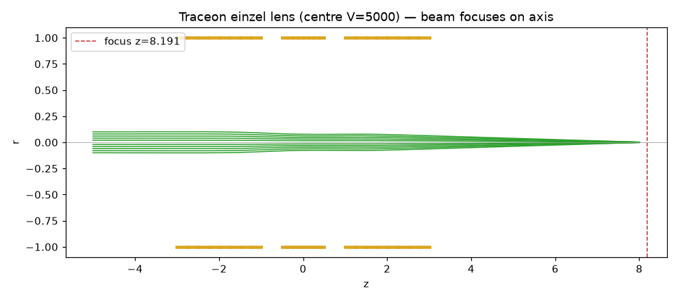
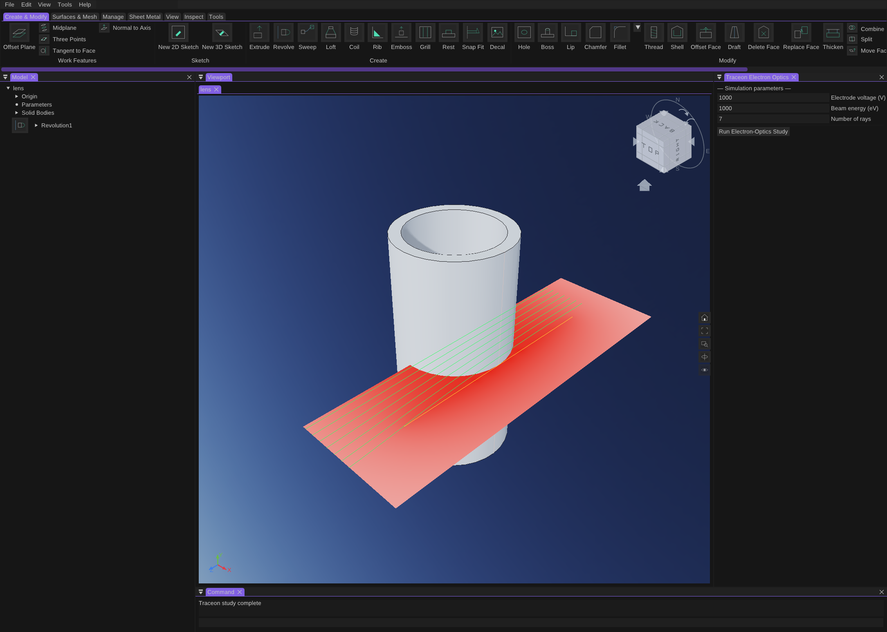
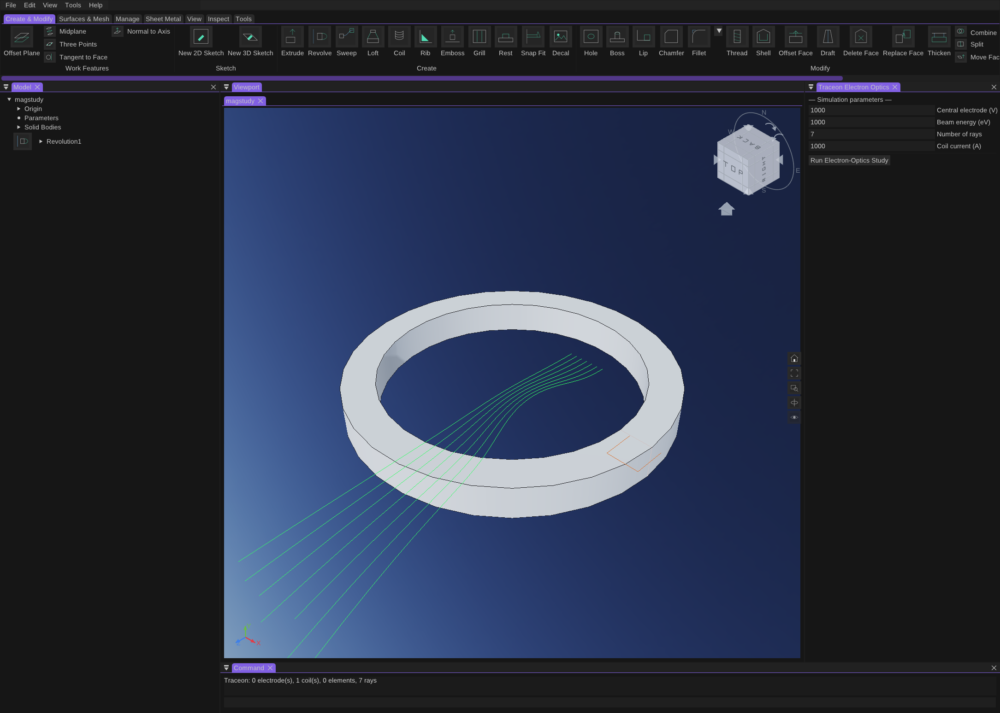

# Validation

Two layers of validation back the Traceon port: per-module oracle tests (every `core/`
package, checked against the upstream Traceon backend at `np.isclose` tolerances) and the
**end-to-end** integration test below, which runs the whole pure-Go stack on a complete
electron-optics problem and asserts it reproduces Traceon's result.

## End-to-end: einzel-lens focal length

`validation/einzel_test.go` builds a three-electrode einzel lens (two grounded outer tubes,
a 5 kV centre tube) directly as (r, z) BEM elements, then runs the **entire** pipeline —
charge solve → field reconstruction → RKF45 ray tracing → least-squares focus — and compares
the focal point to Traceon computing the identical case.

Result: the Go stack lands the beam on the axis at

```
focus z = 8.190615   (Traceon: 8.190615)
```

— agreement to ~1e-6, and the full 1240-step trajectory of the outermost ray matches Traceon
step for step. Because the focal point is a sensitive derived quantity, this single number
exercises the solver, field, tracer, and focus together.

Regenerate the golden + plot from the upstream clone:

```
../Traceon/.venv/bin/python tools/gen_einzel.py --traceon-dir ../Traceon
go test ./validation/...
```

### Visual confirmation

`validation/testdata/einzel.png` (regenerated above) shows the parallel beam entering from
the left, passing the three electrodes (gold), and converging on the axis — the lens focuses,
exactly as the trajectory numbers assert.



## Live in-application validation

This was run end to end against the live application: the head was launched with the MCP
bridge + Traceon add-ins, an axisymmetric tube electrode was built over MCP, and
`Traceon.RunStudy` was fired. The study sectioned the body, solved, traced, and rendered its
overlay — the potential heatmap and the particle trajectories — into the viewport, with a
"Traceon study complete" status:



The dockable **Traceon Electron Optics** panel (electrode voltage / beam energy / ray count +
Run button) is visible on the right.

### Magnetostatic (current coils)

A solid body is treated as a current **coil** (rather than a voltage electrode) when it carries
a current in the `traceon/currents` attribute or its name contains "coil". Its (r,z)
cross-section is triangulated into current rings carrying a uniform current density (total
current / area), and the beam is traced through the combined field with the Lorentz force
`a = q/m·(E + μ₀·v×H)`. Live: a revolved ring renamed "Coil1" energised at 1000 A acts as a
magnetic lens — the beam visibly converges as it passes through the coil:



### Procedure

The add-in is driven from the running application; the study is `Traceon.RunStudy` (a ribbon
command, also invokable over the MCP bridge's `execute_command`). To reproduce:

1. `make install` — builds the c-shared library and copies it + `manifest.json` into the
   host's `addins/` directory (the host scans it at startup).
2. Launch Oblikovati with the MCP bridge add-in loaded.
3. Over the MCP bridge: `close_all_documents(force)`, build or import an axisymmetric electrode
   (a revolved profile), then `execute_command("Traceon.RunStudy")`.
4. `viewport.capture` a screenshot and confirm the electrode, the potential heatmap, and the
   focusing trajectories render.

`cmd/traceonfield` is the offline stand-in: it runs the real section→solve→trace→render
pipeline against a canned electrode profile and dumps the exact client-graphics payload the
add-in would push, with no live app or render backend:

```
go run ./cmd/traceonfield > study.json   # 3 elements, 7 rays, 9 graphics nodes
```

### Calibration (now in the engine)

- **Units.** Host geometry (cm) is converted to SI metres for the BEM solve and the tracer,
  and trajectories are converted back to cm for rendering. The conversion was verified
  scale-invariant: the same lens solved at scale 1 and scale 0.01 focuses at an identical
  focal length in geometry units (7.68 / 15.14 for two voltage/energy ratios), exactly as the
  Laplace + Newton physics predicts.
- **Per-electrode voltages.** The engine sections *every* solid body and solves them together.
  Voltages come from the document attribute `traceon/voltages` (a JSON `{bodyIndex: volts}`
  map); when unset, the einzel convention applies — the panel voltage biases the axially
  central electrode and the outer electrodes are grounded — so a multi-electrode lens focuses
  with no extra configuration. Live: a three-tube einzel lens sections to 3 electrodes / 108
  elements with the central electrode charged (the potential map concentrates there).
- **Section fidelity.** The (r,z) meridian is the full cross-section boundary (outer wall,
  end caps, and any bore), so the aperture fields that focus the beam are modelled — not only
  the outer silhouette.
